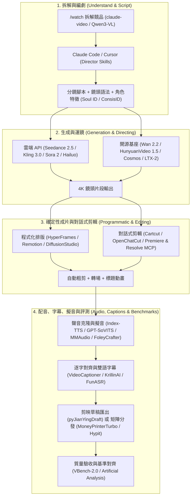

# 🎬 Awesome Video Agent Skills

[](https://awesome.re)
[](https://tenten.co)
[](CONTRIBUTING.md)
[](LICENSE)
[](https://github.com/tentenco/awesome-video-agent-skills)

> 🚀 **目前 GitHub 上，給 Video Agent / Agent Skill 最全、最新、實戰首選的開源庫 (Curated Collection of AI Video Agents, Director Skills, MCP Tools & Autonomous Video Pipelines)**
> 
> *Curated by [Tenten AI](https://tenten.co). Snapshot: 2026-10-08.*

---

## 📖 為什麼 Tenten AI 要整理這個專案？

Tenten AI 是一間 **AI-native Digital Agency & Creative Studio**。我們在第一線運營自媒體、孵化 Influencer / 創作者，同時為企業品牌客戶操盤 YouTube、Shorts、Reels、TikTok 頻道與商業 TVC 廣告。

這份清單**不是學術論文彙編**，也不是「只要名稱有 video 就收」的星數灌水排行。每一個收錄專案都必須通過產線內部的同一道檢驗標準：

> 💡 **「這週若要幫一個頻道或客戶出片，我們會不會把這個 repo 交給 coding agent 來跑？」**

**會，才留下。過期、沒在維護、或只剩 2023–2024 光環的專案，直接淘汰。**

### 🎯 收錄原則 (Curation Rules)：

1. **越新越好 (Freshness First)**：2026 年的專案權重高於 2025 年；同年之中，仍在持續維護與推送的排在前面。
2. **能被 Agent 驅動 (Agent-Native)**：具備 `SKILL.md`、MCP (Model Context Protocol)、CLI 或穩定的 API。僅支援滑鼠點擊的純 GUI 工具不進主清單。
3. **實戰驗證 (Production-Tested)**：主清單以 **GitHub Stars $\ge$ 300** 與維護狀態把關；星數未滿 300 但產線正在使用的高潛力 Skill 則獨立收錄至 [潛力觀察名單 (Watchlist)](#-潛力觀察名單-watchlist)。
4. **一個職位只留最好 (Best-in-Class)**：同類工具只保留 canonical 與活躍維護版本，其餘明確記錄於 [明確排除與淘汰名單](#-明確排除與淘汰名單-deliberately-excluded)。

---

## 🗺️ 目錄 (Table of Contents)

- [🎬 實戰產線架構 (Production Architecture)](#-實戰產線架構-production-architecture)
- [🏆 實戰首選組合 (First Picks)](#-實戰首選組合-first-picks)
- [🌟 1. 多 Agent 虛擬製片廠 (Autonomous Multi-Agent Studios)](#-1-多-agent-虛擬製片廠-autonomous-multi-agent-studios)
- [💻 2. 程式化與確定性成片引擎 (Programmatic Video Engines)](#-2-程式化與確定性成片引擎-programmatic-video-engines)
- [✂️ 3. 對話式剪輯師與 MCP 時間軸工具 (Conversational Editors & MCP Timeline)](#-3-對話式剪輯師與-mcp-時間軸工具-conversational-editors--mcp-timeline)
- [🧠 4. AI 導演技能包與跨模型提示詞協議 (Director Skills & Prompt Protocols)](#-4-ai-導演技能包與跨模型提示詞協議-director-skills--prompt-protocols)
- [👤 5. 數字人、對口型與動作遷移 (Talking Head, Lip-Sync & Motion Transfer)](#-5-數字人對口型與動作遷移-talking-head-lip-sync--motion-transfer)
- [🎙️ 6. 旁白配音、聲音克隆與音訊管線 (Voice for Video & Audio Cloning)](#-6-旁白配音聲音克隆與音訊管線-voice-for-video--audio-cloning)
- [📝 7. 字幕、智慧切片與剪映/PR草稿 (Captions, Clipping & NLE Drafts)](#-7-字幕智慧切片與剪映pr草稿-captions-clipping--nle-drafts)
- [🚀 8. 短影音工廠與頻道矩陣自動化 (Shorts & Channel Automation Factories)](#-8-短影音工廠與頻道矩陣自動化-shorts--channel-automation-factories)
- [👁️ 9. 影片拆解、競品分析與成片 QC (Watch, Understand & QC)](#-9-影片拆解競品分析與成片-qc-watch-understand--qc)
- [🎥 10. SOTA 開源影音基座與推論加速 (Open-Weight Models & Local Inference)](#-10-sota-開源影音基座與推論加速-open-weight-models--local-inference)
- [📐 11. 分鏡預演與視覺開發 (Storyboard, Previs & Drafting)](#-11-分鏡預演與視覺開發-storyboard-previs--drafting)
- [⚙️ 12. 基礎設施與底層依賴 (Core Infrastructure)](#-12-基礎設施與底層依賴-core-infrastructure)
- [📊 13. 評測基準、前沿報告與調研報告 (Benchmarks, Technical Reports & SOTA Leaderboards)](#-13-評測基準前沿報告與調研報告-benchmarks-technical-reports--sota-leaderboards)
- [👀 潛力觀察名單 (Watchlist)](#-潛力觀察名單-watchlist)
- [🚫 明確排除與淘汰名單 (Deliberately Excluded)](#-明確排除與淘汰名單-deliberately-excluded)
- [🛠️ 如何在你的 Agent 中安裝與調用技能 (Quick Start Guide)](#️-如何在你的-agent-中安裝與調用技能-quick-start-guide)
- [🤝 貢獻指南 (Contributing)](#-貢獻指南-contributing)

---

## 🎬 實戰產線架構 (Production Architecture)

現代 Agentic 影音生產流水線依據**產線職位**分工：



---

## 🏆 實戰首選組合 (First Picks)

這是現階段推薦優先配置給 Coding Agent 的核心組合：

1. **看懂素材、拆解競品與成片 QC** ➔ **[claude-video](https://github.com/bradautomates/claude-video)** (`/watch` 抽幀、轉寫、自評) + **[reelbench-skills](https://github.com/eternityspring/reelbench-skills)** (本地零依賴逐鏡拉片、15 道質檢)
2. **端到端 Agent 製片廠** ➔ **[OpenMontage](https://github.com/calesthio/OpenMontage)** (12 條流水線、數百個 Skill 集合) + **[hypit](https://github.com/hypit-ai/hypit)** (爆款短影音克隆、自動換臉與 100 變體裂變)
3. **HTML 程式化直接出 MP4** ➔ **[HyperFrames](https://github.com/heygen-com/hyperframes)** (HeyGen 開源，零擴散失真、像素級確定)
4. **React 精品動態與鏡頭配方** ➔ **[remotion-dev/skills](https://github.com/remotion-dev/skills)** + **[video-shotcraft](https://github.com/Vincentwei1021/video-shotcraft)** + **[onetake](https://github.com/feitangyuan/onetake)** (一鏡到底宣傳片)
5. **口播／訪談自動粗剪** ➔ **[video-use](https://github.com/browser-use/video-use)** + **[chengfeng-videocut-skills](https://github.com/Agentchengfeng/chengfeng-videocut-skills)** (自然語言自動去贅字、生成交互式 Web 審核)
6. **時間軸級對話式 NLE** ➔ **[OpenChatCut](https://github.com/0xsline/OpenChatCut)** + **[cartcut](https://github.com/cartesiancs/cartcut)** (開源分層 NLE、原生 MCP 時間軸操控、支援 `⌘Z`)
7. **專業 NLE 宿主 MCP 橋接** ➔ **[Adobe_Premiere_Pro_MCP](https://github.com/hetpatel-11/Adobe_Premiere_Pro_MCP)** + **[davinci-resolve-mcp](https://github.com/apvlv/davinci-resolve-mcp)**
8. **角色一致性與導演主力包** ➔ **[ConsisID](https://github.com/PKU-YuanGroup/ConsisID)** (免微調身份保持 SOTA) + **[Emily2040/seedance-2.0](https://github.com/Emily2040/seedance-2.0)** + **[CameraCtrl](https://github.com/hehao13/CameraCtrl)** (物理相機軌跡控制)
9. **聲音克隆、音效與神經擬音** ➔ **[Index-TTS](https://github.com/index-tts/index-tts)** + **[MMAudio](https://github.com/hkchengrex/MMAudio)** + **[FoleyCrafter](https://github.com/open-mmlab/FoleyCrafter)** (動作級精確擬音)
10. **全流程評測基準與工業天梯** ➔ **[Artificial Analysis Video Arena](https://artificialanalysis.ai/)** + **[VBench-2.0](https://github.com/Vchitect/VBench)**

---

## 🌟 1. 多 Agent 虛擬製片廠 (Autonomous Multi-Agent Studios)

> 把 Coding Agent 當成完整製片組，涵蓋編劇、導演、分鏡、生成到後期審批。

| 專案名稱 | 介面 / 技術棧 | 核心亮點 | 實戰點評 |
| :--- | :--- | :--- | :--- |
| **[OpenMontage](https://github.com/calesthio/OpenMontage)** <br>`calesthio/OpenMontage` | 🤖 `Claude Code` `Cursor` | • 2026 開源 agentic 製片系統，內建 12 條 pipeline、100+ tools、700+ skill 檔。<br>• 模擬真實劇組調度：調研、腳本、分鏡、素材抓取到最終渲染。 | 🔥 **2026 必備開源黑馬**：實戰產線的預設整包，讓 coding agent 一秒化身專業影視後期組。 |
| **[hypit](https://github.com/hypit-ai/hypit)** <br>`hypit-ai/hypit` | 🚀 `~19.6k Stars` `TypeScript` | • 爆款短影音風格克隆與批量變體全自動化工廠。<br>• 覆蓋換臉 (Face Swap)、腳本改寫、B-roll 自動混剪，單一命令可生成 100 種不同版本測試素材。 | 👑 **矩陣裂變神器**：社群行銷廣告批量 A/B 測試必備。 |
| **[ViMax](https://github.com/HKUDS/ViMax)** <br>`HKUDS/ViMax` | 🎬 `Python` `PyTorch` | • 港大數據科學團隊開源的端到端虛擬製片廠。<br>• 內建 Director、Screenwriter、Producer、Generator 四大角色。<br>• 獨創 **AutoCameo** 人物鎖定技術與階層式 RAG 敘事引擎。 | ⭐ **電影級敘事首選**：解決多場景長影片的人物臉孔崩塌與情節失憶問題。 |
| **[video-use](https://github.com/browser-use/video-use)** <br>`browser-use/video-use` | 🤖 `FFmpeg` `Claude Skill` | • Browser Use 出品的 Agentic 剪輯庫。<br>• 丟入原始素材，Agent 自動去語氣詞、調色、燒字幕、疊加動態並在切點自評。 | 🔥 **口播訪談粗剪神器**：徹底解放剪輯師雙手，口述需求即可完成粗剪與短影音切片。 |
| **[vox-director](https://github.com/Alisa0808/vox-director)** <br>`Alisa0808/vox-director` | ✂️ `~2.1k Stars` `Atlas Cloud` | • 將任何主題一鍵轉化為 Vox 風格剪貼畫 (Paper-collage) 解說片或廣告片。<br>• 全流程涵蓋編劇、拼貼關鍵幀生成、動態圖形、配音、配樂與字幕壓制。 | 🎓 **知識科普解說標竿**：產出風格強烈、極具吸引力的高質感動態解說片。 |
| **[reelmimic](https://github.com/edenfunf/reelmimic)** <br>`edenfunf/reelmimic` | 🎨 `~1.4k Stars` `Claude/Codex` | • 參考影片風格拉片復刻：解析原始影片的剪輯節奏、鏡頭時長、轉場與色彩。<br>• 多 Agent 協同製片組，內建 7 大 2D 渲染引擎（向量動效、水彩、定格、動漫等）。 | 🌟 **風格復刻與動畫神器**：非侵入式學習優秀爆款運鏡語意與視覺節奏。 |
| **[onetake](https://github.com/feitangyuan/onetake)** <br>`feitangyuan/onetake` | 🎥 `~1.7k Stars` `Agent Skill` | • 「一鏡到底 (One Continuous Camera)」動態宣傳片與 Demo 引擎。<br>• 鏡頭元素自然過渡至下一場景，內建 `probe.py` 進行幀級連戲與運動模糊質檢。 | 🚀 **產品發布片新標準**：告別突兀硬切，呈現流暢絲滑的連續鏡頭體驗。 |
| **[screenwriting-skills](https://github.com/jtydhr88/screenwriting-skills)** <br>`jtydhr88/screenwriting-skills` | 📖 `~1.6k Stars` `26 Skills` | • 劇作大師級編劇 Agent Skill 套件，精煉自 47 本專業影視劇作經典與 23 套名劇劇本。<br>• 涵蓋三幕劇結構、人物弧光、對白打磨與情節節奏診斷。 | 💡 **專業劇本底層大腦**：大幅提升 AI 編劇的戲劇張力與人物深度。 |
| **[FireRed-OpenStoryline](https://github.com/FireRedTeam/FireRed-OpenStoryline)** <br>`FireRedTeam/FireRed-OpenStoryline` | 🎞️ `Python` `Editing Agent` | • 將人工時間軸剪輯經驗轉化為 AI editing agent。<br>• 專門為「已有大量素材、需 Agent 完成第一次結構化粗剪」設計。 | 🎯 **長素材粗剪利器**：適合紀錄片、訪談素材與活動記錄的自動梳理。 |
| **[HKUDS/VideoAgent](https://github.com/HKUDS/VideoAgent)** <br>`HKUDS/VideoAgent` | 🧠 `Multi-Agent` `CVPR` | • 理解、剪輯、生成融為一體的 Agentic 框架。<br>• 適用於「看完原始影片再進行智慧剪輯」而非單純文字生成畫面。 | 💡 **智慧剪輯研究標竿**：具備強大的長視頻記憶與上下文檢索能力。 |
| **[Toonflow](https://github.com/zai-org/Toonflow-app)** <br>`zai-org/Toonflow-app` | 🎨 `~14.7k Stars` `Desktop` | • 一站式 AI 動畫短劇與動漫創作工作站。<br>• 覆蓋故事大綱、劇本分鏡、角色設定、動作生成到最終成片，支援視覺化分鏡板。 | 🏆 **二次元/短劇必備**：極大降低短劇出海與漫畫推文視頻的量產門檻。 |
| **[dramaclaw](https://github.com/dramaclaw/dramaclaw)** <br>`dramaclaw/dramaclaw` | 🎭 `AIGC Engine` | • 劇本到成片的通用 AIGC 引擎：專注短劇、商業廣告與知識解說。 | 🎬 **短劇流水線**：適合需要批量產出短劇片段的工作室。 |
| **[vargHQ/sdk](https://github.com/vargHQ/sdk)** <br>`vargHQ/sdk` | 📦 `TypeScript` `JSX SDK` | • 專為視頻開發的 JSX SDK，一層 API 直接串接 Kling、Flux、ElevenLabs 與 Veed。<br>• 適合將生成直接寫入專屬 Agent 應用程式。 | 💻 **開發者友善**：用熟悉的 React 語法統一管理多模態生成服務。 |

---

## 💻 2. 程式化與確定性成片引擎 (Programmatic Video Engines)

> 文字、HTML、React 代碼進，100% 確定性的 MP4 出。品牌色、數字、字幕不能靠擴散模型賭。

| 專案名稱 | GitHub Stars | 核心亮點 | 實戰點評 |
| :--- | :--- | :--- | :--- |
| **[HyperFrames](https://github.com/heygen-com/hyperframes)** <br>`heygen-com/hyperframes` | 🚀 **HeyGen 官方出品** | • **Write HTML. Render video.** Agent 原生架構。<br>• 任何 Coding Agent 都會寫 HTML/CSS，同一輸入每次產出完全一致。<br>• 完美統一品牌規範、Logo 位置與精確文字排版。 | 👑 **產品與數據影片首選**：製作產品更新、動態數據片、個人化 outreach 的預設引擎。 |
| **[Remotion](https://github.com/remotion-dev/remotion)** <br>`remotion-dev/remotion` | ⭐ **~25,300+** | • 使用 **React + TypeScript** 透過代碼構建動態視頻的行業標準。<br>• 支援 GPU 硬體加速與 AWS Lambda Serverless 批次渲染。<br>• 提供龐大的生態系與官方 [remotion-dev/skills](https://github.com/remotion-dev/skills)。 | 🏆 **現代影音工程基石**：動態複雜度高，最適合精品 Motion Graphics 與雲端批次生成。 |
| **[diffusionstudio/core](https://github.com/diffusionstudio/core)** <br>`diffusionstudio/core` | ⭐ **~5.5k+** | • 瀏覽器原生、高效能 WebCodecs + Canvas2D 宣告式影音合成引擎 (TypeScript)。<br>• 具備分層時間軸、關鍵幀插值、靜音切除與富文本排版。 | ⚡ **Web 影音原生引擎**：免本機重型依賴，打造瀏覽器端輕量影音編輯體驗。 |
| **[pixel2motion](https://github.com/nolangz/pixel2motion)** <br>`nolangz/pixel2motion` | ⭐ **~2.4k+** | • 將靜態點陣圖 Logo 自動轉化為高畫質流暢 SVG 向量動畫的 Agent Skill。<br>• 輸出可交互 HTML 預覽、透明通道視頻與動態 QA 報告。 | ✨ **標誌動效首選**：商業片頭、片尾與 UI 動態圖標快速封裝神器。 |
| **[video-shotcraft](https://github.com/Vincentwei1021/video-shotcraft)** <br>`Vincentwei1021/video-shotcraft` | ⭐ **~5.6k+** | • 2026 成長最快的產品片 Skill 之一。<br>• 內建 152 張鏡頭配方卡、209 段 motion preview、2.5D 運鏡，可直接匯出剪映草稿。 | 🎯 **SaaS 與科技產品片標竿**：大幅降低專業 motion 運鏡的編程門檻。 |
| **[Manim](https://github.com/ManimCommunity/manim)** <br>`ManimCommunity/manim` | ⭐ **~65,000+** | • 3Blue1Brown 創立的專業數學與邏輯動畫社群版引擎 (Python)。<br>• Agent 能夠直接編寫 Python 腳本生成極致精美的圖表、公式推導動畫。 | 🎓 **科普與教育必備**：知識型博主、技術教學頻道生成高水準動態說明的必備底層。 |
| **[adithya-s-k/manim_skill](https://github.com/adithya-s-k/manim_skill)** <br>`adithya-s-k/manim_skill` | ⭐ **~1.1k+** | • 專為 Claude Code 與 Coding Agent 設計的 Manim 動態技能包。<br>• 讓 Agent 能夠自主編寫、除錯並直接編譯高精度科技與數學可視化影片。 | 📐 **技術視覺化必裝**：大幅提升 Agent 產出高難度數據動態的成功率。 |
| **[guizang-product-video-skill](https://github.com/op7418/guizang-product-video-skill)** <br>`op7418/guizang-product-video-skill` | ⭐ **~690+** | • 專注軟體產品更新與 SaaS 功能展示的 Agent Skill。<br>• 支援直接復用真實 UI 組件、設計系統 Token 與自定義按鈕音效。 | 💻 **SaaS 產品更新視頻標竿**：將 Release Notes 轉為吸睛產品短片的利器。 |
| **[nexu-io/html-video](https://github.com/nexu-io/html-video)** <br>`nexu-io/html-video` | 🌐 `Open Design` | • 開源 HTML-to-video runtime，適合 coding agent 在本機筆電上快速出 MP4。 | ⚡ **輕量渲染**：HyperFrames 的開源本地替代方案。 |
| **[geekjourneyx/hyperframes-motion-director](https://github.com/geekjourneyx/hyperframes-motion-director)** <br>`geekjourneyx/hyperframes-motion-director` | 🎬 `Agent Skill` | • 中文優先的 HyperFrames 導演 Skill：文章、產品官網、README 輸入，動效片直接輸出。 | 📖 **自動動態包裝**：快速將技術文檔與文章轉為生動的宣傳短片。 |

---

## ✂️ 3. 對話式剪輯師與 MCP 時間軸工具 (Conversational Editors & MCP Timeline)

> 讓 Agent 真正能夠操作時間軸，而非只能一次次重新渲染整條視頻。

| 專案名稱 | 技術棧 / 協議 | 核心亮點 | 實戰點評 |
| :--- | :--- | :--- | :--- |
| **[cartcut](https://github.com/cartesiancs/cartcut)** <br>`cartesiancs/cartcut` | ⭐ **~760+** `MCP Native` | • 為 AI Agent 打造的開源分層視頻編輯器，原生透過 MCP 暴露即時時間軸。<br>• Agent 可透過自然語言執行微調、文稿剪輯、Whisper 字幕、關鍵幀動態與 8K FFmpeg 渲染。<br>• 完整支援人類創作者 `⌘Z` 撤銷與手動微調。 | 👑 **Agent-Native 開源 NLE 標竿**：非破壞式人機協同，徹底打通 Agent 與時間軸。 |
| **[OpenChatCut](https://github.com/0xsline/OpenChatCut)** <br>`0xsline/OpenChatCut` | 💻 `Local-First` `MCP` `React` | • 本地優先的對話式 AI 視頻編輯器，兼具專業多軌可視化時間線。<br>• 支援 AI Agent 透過 MCP 協議在時間線上精確下達剪輯、轉場與效果指令。<br>• 創作者保有最終手動調整權。 | ⭐ **人機協同剪輯先驅**：ChatCut 的開源本地替代方案。 |
| **[ChatCut Agent Plugin](https://github.com/ChatCut-Inc/agent-plugin)** <br>`ChatCut-Inc/agent-plugin` | 🔌 `Official MCP` | • 官方 plugin，讓 Claude Code / Codex 透過 MCP 直接進入 ChatCut。<br>• 支援時間軸、動效、素材管理、字幕與編排內即時驗證。 | 💼 **官方擴充模組**：適合已經深度使用 ChatCut 商業生態的團隊。 |
| **[Adobe_Premiere_Pro_MCP](https://github.com/hetpatel-11/Adobe_Premiere_Pro_MCP)** <br>`hetpatel-11/Adobe_Premiere_Pro_MCP` | 🔌 `~650+ Stars` `PR API` | • 連接 AI Agent（Cursor / Claude）與 Adobe Premiere Pro 的官方級 MCP 伺服器。<br>• Agent 可直接在 PR 時間線上建立軌道、導入素材、自動切除氣口與套用預設。 | 💼 **專業工作室必備**：無縫嵌入現有影視後製工作流，無痛升級 Agent 化。 |
| **[davinci-resolve-mcp](https://github.com/apvlv/davinci-resolve-mcp)** <br>`apvlv/davinci-resolve-mcp` | 🎞️ `Python` `Resolve API` | • DaVinci Resolve Studio 專用 MCP 服務器。<br>• 支援項目管理、媒體池管理、時間線剪輯操作與 Fusion 節點合成，實現 Agent 驅動調色。 | 🎨 **調色剪輯旗艦橋接**：適合習慣在 DaVinci 中進行電影級調色與合成的工作室。 |
| **[ffmpeg-mcp](https://github.com/PedroMarianoAlmeida/ffmpeg-mcp)** <br>`PedroMarianoAlmeida/ffmpeg-mcp` | ⚡ `Node.js` `Bundled Binaries` | • 內建靜態二進位檔的 FFmpeg MCP 伺服器，免安裝系統依賴。<br>• 支援智能裁剪、縮放、音軌抽離、格式轉換與自定義濾鏡鏈調用。 | 🛠️ **底層音影操作核心**：讓 Agent 擺脫繁複命令列參數，用自然語言調動 FFmpeg。 |
| **[comfy-mcp](https://github.com/Comfy-Org/comfy-mcp)** <br>`Comfy-Org/comfy-mcp` | 🔌 `Comfy-Org Official` | • ComfyUI 官方開源 MCP 伺服器。<br>• 將 ComfyUI 本地節點工作流導出為 Agent 可調用工具，支援動態參數綁定與批次生圖/出片。 | 🧩 **擴散生成官方通道**：本地 ComfyUI 工作流與 Coding Agent 的最佳黏著劑。 |
| **[baocut](https://github.com/JimLiu/baocut)** <br>`JimLiu/baocut` | ⭐ **~520+** `Agent Skill` | • 專為 BaoCut macOS 應用與 CLI 設計的 Agent Skill。<br>• 自然語言驅動長視頻轉寫、雙語字幕對齊、多說話人標註與視頻工程導出。 | 🎙️ **雙語訪談剪輯助手**：適合雙語 Podcast 與長篇講座快速精剪。 |
| **[OpenCut](https://github.com/OpenCut-app/OpenCut)** <br>`OpenCut-app/OpenCut` | ✂️ `CapCut Alternative` | • 開源 CapCut 網頁替代版，具備完整時間軸本體。<br>• 適合需要給非工程師人員手動微調的交付場景。 | 🛠️ **視覺化交付**：適合做為客戶或審核人員的線上檢視介面。 |
| **[DaVinci-AutoEdit-Agent](https://github.com/liuluhaixiu/DaVinci-AutoEdit-Agent)** <br>`liuluhaixiu/DaVinci-AutoEdit-Agent` | 🎞️ `DaVinci Resolve` `Python API` | • 自媒體向 DaVinci 專用 Skill：分析素材、產出剪輯藍圖，經 Resolve API 建立時間線，人類審批後才渲染。 | 🎬 **全流程剪輯藍圖**：自媒體創作者的 Resolve 自動化管線。 |

---

## 🧠 4. AI 導演技能包與跨模型提示詞協議 (Director Skills & Prompt Protocols)

> 模型每季升級，Skill 的價值在於：Agent 不用每次重新學習運鏡、連戲與多參考圖組合。

| 專案名稱 | 支援模型 / 框架 | 核心亮點 | 實戰點評 |
| :--- | :--- | :--- | :--- |
| **[Emily2040/seedance-2.0](https://github.com/Emily2040/seedance-2.0)** <br>`Emily2040/seedance-2.0` | ⚡ `Seedance 2.0/2.5` `Agent Skill` | • Seedance 四模態製片管線：分鏡、運鏡、燈光、表演、聲音、跨鏡連戲與失敗診斷。<br>• 星數與更新活躍度遠超單純的提示詞範本。 | 🏆 **Seedance 產線主包**：生成連貫鏡頭與角色動作時的必備基礎。 |
| **[higgsfield-ai-prompt-skill](https://github.com/OSideMedia/higgsfield-ai-prompt-skill)** <br>`OSideMedia/higgsfield-ai-prompt-skill` | 🎬 `Higgsfield` `Seedance 2.5` `Claude Skill` | • 內含 32 個子技能：Seedance 2.5 omni-reference、MCSLA 語法體系、Soul ID 角色鎖定與 Kling 3.0 運動控制。 | 🌟 **電影美學大師**：在 Higgsfield / Seedance 上出高質感商業片時的預設配置。 |
| **[lanshu-awesome-ai-video-kit](https://github.com/cclank/lanshu-awesome-ai-video-kit)** <br>`cclank/lanshu-awesome-ai-video-kit` | 🌐 `15+ Models` `Claude Skills` | • 跨 15 個主流模型（Sora、Veo、Kling、Runway 等），收錄 500+ 實測 Prompt 與 7 個 Claude Skill。<br>• 內建 model-selector 與每週自動 CI 校驗。 | 📚 **跨模型公式字典**：面對不同場景指定不同模型時的最佳 Prompt 參考庫。 |
| **[Wan-skills](https://github.com/Wan-Video/Wan-skills)** <br>`Wan-Video/Wan-skills` | 👑 `Wan 2.2/2.1` `Alibaba Official` | • 阿里通義萬相官方出品的 Agent Skills 套件。<br>• 封裝 API 調用、圖像生成擴展、影音生成任務狀態輪詢與 PPTX 轉換流程。 | 🎯 **Wan-Video 官方首選**：標準化接入通義影音模型的官方技能包。 |
| **[CameraCtrl](https://github.com/hehao13/CameraCtrl)** <br>`hehao13/CameraCtrl` | 🎥 `CVPR` `Exact Trajectory` | • 精確相機軌跡控制框架，將相機位姿（Pan, Tilt, Zoom, Roll, Dolly）精確編碼注入視頻擴散模型。<br>• 徹底解決模型「自由漂移」痛點，提供真正的電影級機位運動。 | 📐 **物理級相機控制**：精確控制主觀視角與複雜運鏡路線必備。 |
| **[reelbench-skills](https://github.com/eternityspring/reelbench-skills)** <br>`eternityspring/reelbench-skills` | ⭐ **~860+** `0 NPM / FFmpeg` | • 本地優先的 AI 影音實用技能包。內建 `video-shots`（15 項質檢指標的逐鏡拉片）、`video-sync`（互動同步報表）與 `video-scrub`（敏感元數據脫敏）。 | 🔬 **逐鏡拉片與質檢標竿**：零外部依賴、純本地安全運行的審核工具。 |
| **[narrator-ai-cli-skill](https://github.com/NarratorAI-Studio/narrator-ai-cli-skill)** <br>`NarratorAI-Studio/narrator-ai-cli-skill` | ⭐ **~3.0k Stars** `CLI Skill` | • 「AI 解說大師」專用技能包，為 Claude/Codex 封裝 narrator-ai-cli。<br>• 一鍵調用長篇影視拉片、文案二次創作、語音畫面自動對齊與成片輸出。 | 🎬 **影視解說自動化專家**：批量製作影視解說與漫劇視頻必備。 |
| **[chengfeng-videocut-skills](https://github.com/Agentchengfeng/chengfeng-videocut-skills)** <br>`Agentchengfeng/chengfeng-videocut-skills` | ⭐ **~3.0k Stars** `Claude Skill` | • 口播視頻自動粗剪與審查工作台。自動辨識贅詞口誤與靜音，生成 `review.html` 交互式審核頁。<br>• 待創作者在網頁端點選確認後才執行實際剪切並導出對齊字幕。 | 🎯 **人機協同審核神器**：讓 AI 粗剪與人類最終確認形成完美閉環。 |
| **[MiniMax-AI/skills](https://github.com/MiniMax-AI/skills)** <br>`MiniMax-AI/skills` | 🐚 `Hailuo` `MiniMax Official` | • MiniMax 官方 Agent Skills。`minimax-multimodal-toolkit` 覆蓋海螺視頻、TTS、音樂與多場次長片。 | 🎯 **Hailuo 官方首選**：優先安裝官方包以獲取第一手參數支援。 |
| **[ai-shortfilm-prompts](https://github.com/jnMetaCode/ai-shortfilm-prompts)** <br>`jnMetaCode/ai-shortfilm-prompts` | 🎥 `Film Structure` | • 將任何創意點子轉換為 Sora / Kling / Veo / Seedance 的電影向 Prompt。<br>• 內建 21 個類型模板與五段式敘事評估。 | 💡 **故事短片專用**：迅速將故事綱要轉化為專業電影劇本結構。 |

---

## 👤 5. 數字人、對口型與動作遷移 (Talking Head, Lip-Sync & Motion Transfer)

> 口播、課程、虛擬主播。2026 年產線切勿再使用已停更的 2024 舊模型。

| 專案名稱 | 核心技術 | 核心亮點 | 實戰點評 |
| :--- | :--- | :--- | :--- |
| **[LivePortrait](https://github.com/KlingAIResearch/LivePortrait)** <br>`KlingAIResearch/LivePortrait` | 肖像動作遷移 <br>`~15k+ Stars` | • 快手開源的頂級肖像驅動模型。<br>• 僅需一張靜態圖片或短片即可將面部表情生動「演」起來。 | 👑 **肖像動畫開源預設**：表情細膩自然，極度適合虛擬頭像與表情包製作。 |
| **[EchoMimicV3](https://github.com/antgroup/echomimic_v3)** <br>`antgroup/echomimic_v3` | 1.3B 統一多模態 <br>`AAAI 2026` | • 螞蟻集團開源，1.3B 參數即可實現肖像、半身與手勢肢體的高保真動畫。<br>• 顯著降低計算資源消耗，相容音頻驅動與關鍵點驅動。 | 🔥 **2026 輕量數字人上限**：兼顧生成速度與全身動作連貫性。 |
| **[Hallo2](https://github.com/fudan-generative-vision/hallo2)** <br>`fudan-generative-vision/hallo2` | 超長高清肖像動畫 | • 復旦與百度聯合研發，突破短片段限制，支援超長時長、4K 高解析度口播視頻。<br>• 音畫時間對齊精準，大幅減少長時間生成產生的面部抖動與漂移。 | 🎙️ **長篇高清演說首選**：製作數分鐘連貫演說與高端虛擬講師視頻標配。 |
| **[ConsisID](https://github.com/PKU-YuanGroup/ConsisID)** <br>`PKU-YuanGroup/ConsisID` | 免微調身份保持 <br>`CVPR 2025 Highlight` | • 北大 YuanGroup 出品，頻率分解 (Frequency Decomposition) 保持人物身份一致性。<br>• 拆解全域結構與細緻五官特徵，徹底解決連續鏡頭換場景「人臉崩塌」痛點。 | 🛡️ **角色一致性 SOTA 標竿**：長篇故事短劇多分鏡拍攝時鎖定主角必用。 |
| **[Duix-Avatar](https://github.com/duixcom/Duix-Avatar)** <br>`duixcom/Duix-Avatar` | 離線數字人 <br>`Commercial-Ready` | • 輕量級離線數字人工具包，支援本地即時渲染與對話互動。 | 💼 **本機商用數字人首選**：資料不離地，適合企業內部培訓與隱私要求高的場景。 |
| **[InfiniteTalk](https://github.com/MeiGen-AI/InfiniteTalk)** <br>`MeiGen-AI/InfiniteTalk` | 長時長口播視頻 | • 支援不限長度的說話視頻生成，圖生或視頻驅動，解決長片不連貫問題。 | 🎙️ **長篇口播必用**：製作 10 分鐘以上長篇解說或財經課程極為穩定。 |
| **[MuseTalk](https://github.com/TMElyralab/MuseTalk)** <br>`TMElyralab/MuseTalk` | 即時高品質唇形同步 | • 騰訊音樂開源的實時音頻驅動唇形同步框架，延遲極低、清晰度高。 | ⚡ **對口型首選**：已有高畫質視頻只需替換多語言配音時的標配。 |
| **[LatentSync](https://github.com/bytedance/LatentSync)** <br>`bytedance/LatentSync` | 潛空間唇形同步 | • 字節跳動開源的 Latent Diffusion 唇形同步模型，自然度卓越。 | 🌟 **電影級口型**：MuseTalk 的強大替代方案，邊緣瑕疵極少。 |
| **[SkyReels-A1](https://github.com/SkyworkAI/SkyReels-A1)** <br>`SkyworkAI/SkyReels-A1` | 高表現力肖像擴散 | • 崑崙萬維 Skywork 出品，基於 Video DiT 的表情生動人像動畫模型。<br>• 能精確傳遞眼神神韻與微妙情感變化。 | 🎭 **情緒演繹數字人**：短劇對手戲與充沛情感對白首選。 |
| **[MimicMotion](https://github.com/Tencent/MimicMotion)** <br>`Tencent/MimicMotion` | 高品質人體姿態遷移 | • 騰訊開源，具備強大的置信度引導機制，實現複雜肢體動作與舞蹈的完美遷移。 | 💃 **舞蹈與動作遷移首選**：動作連貫性高於早期 AnimateAnyone。 |

---

## 🎙️ 6. 旁白配音、聲音克隆與音訊管線 (Voice for Video & Audio Cloning)

> 影片 Agent 的成敗一半在畫面，一半在聲音。收錄 2026 現役最穩定的旁白配音、神經擬音與克隆模型。

| 專案名稱 | 語言 / 特性 | 核心亮點 | 實戰點評 |
| :--- | :--- | :--- | :--- |
| **[Index-TTS](https://github.com/index-tts/index-tts)** <br>`index-tts/index-tts` | 中文/英文 <br>`Zero-Shot` | • 工業級、高可控的 zero-shot 語音合成。<br>• 情緒表達豐富，音質清澈，完全無機械感。 | 🏆 **2026 中文旁白首選**：商業旁白與解說生成的主力工具之一。 |
| **[GPT-SoVITS](https://github.com/RVC-Boss/GPT-SoVITS)** <br>`RVC-Boss/GPT-SoVITS` | 多語聲音克隆 <br>`~40k+ Stars` | • 僅需 5 秒至 1 分鐘語音素材即可完成高品質聲音克隆。<br>• 支援跨語言合成與音色微調。 | 👑 **個人 IP 聲音克隆預設**：需要「聽起來像特定講者」時的標準方案。 |
| **[fish-speech](https://github.com/fishaudio/fish-speech)** <br>`fishaudio/fish-speech` | 多語/開源上限 <br>`~15k+ Stars` | • 基於自迴歸 Transformer 的頂級開源 TTS，語氣自然度與呼吸感極佳。 | 🌟 **音質上限標竿**：長篇有聲書與高品質紀錄片旁白首選。 |
| **[MMAudio](https://github.com/hkchengrex/MMAudio)** <br>`hkchengrex/MMAudio` | 影音多模態合成 <br>`Video-to-Audio` | • 清華與 HKUST 開源的視頻配音與音效生成框架。<br>• 同時接收視頻與文本提示詞，自動為無聲畫面生成同步環境音、動作聲效與配樂。 | 🔊 **視頻自動配音首選**：補齊 AI 視頻生成畫面無聲的巨大缺口。 |
| **[FoleyCrafter](https://github.com/open-mmlab/FoleyCrafter)** <br>`open-mmlab/FoleyCrafter` | 神經擬音 (Neural Foley) <br>`OpenMMLab` | • 專為視頻量身打造的高精度擬音合成引擎。<br>• 配備語義適配器與時間控制器，實現腳步聲、碰撞、關門等毫秒級精確對位。 | 🎬 **電影級動作擬音利器**：影視後製中自動生成同步動作音效的標配。 |
| **[ElevenLabs Hosted MCP](https://api.elevenlabs.io/v1/mcp)** <br>`ElevenLabs Official` | 商業頂級多語語音 | • ElevenLabs 官方託管的 MCP 服務器，支援 OAuth 無密鑰安全鑑權。<br>• 讓 Agent 零配置調用全球第一梯隊的逼真情緒配音、音效與自定義克隆音色。 | 🌐 **商業出海配音首選**：多語種情緒爆滿的高端 TVC 旁白通道。 |
| **[Chatterbox](https://github.com/resemble-ai/chatterbox)** <br>`resemble-ai/chatterbox` | 英文旁白旗艦 <br>`Resemble AI` | • 2025–2026 開源 TTS 新旗艦，英文發音自然流暢，節奏感極強。 | 🇺🇸 **英文出海頻道必備**：製作面向北美與全球市場的短影音利器。 |
| **[CosyVoice](https://github.com/QwenAudio/CosyVoice)** <br>`QwenAudio/CosyVoice` | 阿里通義多語生成 | • 阿里開源的多語言多方言語音生成模型，支援精細情緒控制與中英混讀。 | 🌐 **雙語頻道利器**：中英文夾雜科技講解影片的首選。 |
| **[F5-TTS](https://github.com/SWivid/F5-TTS)** <br>`SWivid/F5-TTS` | 非自迴歸 Flow Matching | • 訓練與推理速度極快，長文本合成穩定不崩潰。 | ⚡ **長篇旁白首選**：適合批量合成萬字長文解說。 |
| **[Kokoro](https://github.com/hexgrad/kokoro)** <br>`hexgrad/kokoro` | 超輕量 82M <br>`Local CPU/GPU` | • 僅 82M 參數的超高效 TTS，本機 CPU 即可毫秒級運行，音質驚豔。 | 💡 **草稿與邊緣端神器**：在不佔用 GPU 顯存的情況下快速產出預覽配音。 |

---

## 📝 7. 字幕、智慧切片與剪映/PR草稿 (Captions, Clipping & NLE Drafts)

> 沒有字幕的短影音等於無效傳播。切片與剪映草稿是現代產線交付的關鍵最後一哩。

| 專案名稱 | 核心功能 | 核心亮點 | 實戰點評 |
| :--- | :--- | :--- | :--- |
| **[VideoCaptioner](https://github.com/WEIFENG2333/VideoCaptioner)** <br>`WEIFENG2333/VideoCaptioner` | 卡卡字幕助手 <br>`GUI / CLI` | • 基於 LLM 的語義斷句、字幕校正、雙語翻譯全流程。<br>• 支援個人化字體樣式、動態花字與自動壓制。 | 🏆 **中文產線最常用字幕流**：徹底解決字句太長、斷句不自然的通病。 |
| **[KrillinAI](https://github.com/krillinai/KrillinAI)** <br>`krillinai/KrillinAI` | 人機協同翻譯配音 | • 字幕、配音、高光切片一條龍處理，提供良好的 API 與 Agent 整合介面。 | 🌐 **出海本地化首選**：適合外語視頻引進與本土化二次分發。 |
| **[FunClip](https://github.com/modelscope/FunClip)** <br>`modelscope/FunClip` | 阿里 FunASR 驅動切片 | • 透過語音轉寫文字直接選取想要保留的段落，AI 自動裁剪視頻。 | ✂️ **按文字剪視頻**：快速粗剪長篇演講與會議記錄。 |
| **[pyJianYingDraft](https://github.com/GuanYixuan/pyJianYingDraft)** <br>`GuanYixuan/pyJianYingDraft` | Python 剪映草稿生成 | • 用 Python 直接生成 CapCut / 剪映原生的 `.json` 草稿工程檔。<br>• 包含軌道、特效、關鍵幀、貼紙與字體排版。 | 👑 **交付必備基底**：Agent 完成粗剪後直接生成剪映工程，交給剪輯師精修。 |
| **[auto-editor](https://github.com/WyattBlue/auto-editor)** <br>`WyattBlue/auto-editor` | 自動切除靜音氣口 | • 古典而強大的 CLI 工具，依據音量波形自動切除無聲段落與氣口。 | ⚡ **極速粗剪**：Podcast 與訪談視頻在上傳至 Agent 前的標準預處理步驟。 |
| **[VideoLingo](https://github.com/Huanshere/VideoLingo)** <br>`Huanshere/VideoLingo` | ⭐ **~18.3k Stars** | • **影視級**視頻翻譯、本地化與配音旗艦工具。<br>• 採用 NLP 語義斷句，徹底解決生硬機翻與字幕過長跳行痛點。<br>• 整合 GPT-SoVITS / CosyVoice 聲音克隆，配備個人化字體排版與自動壓制。 | 🏆 **全球化出海第一首選**：翻譯自然度堪比 Netflix 原生字幕，跨境電商與國際頻道必用。 |
| **[pyvideotrans](https://github.com/jianchang512/pyvideotrans)** <br>`jianchang512/pyvideotrans` | ⭐ **~17.6k Stars** | • 開源多語言視頻翻譯與配音神器。<br>• 支援語音識別 (Whisper)、多通道文字翻譯、百種 TTS 引擎以及唇形對齊 (Wav2Lip)。<br>• 提供跨平台圖形客戶端，操作極度直覺。 | 🌟 **全能本地化工具箱**：支援海量音色與翻譯通道，批量處理長篇訪談或教學影片極佳。 |

---

## 🚀 8. 短影音工廠與頻道矩陣自動化 (Shorts & Channel Automation Factories)

> 一鍵端到端「文案 -> 素材檢索 -> 語音合成 -> 智慧字幕 -> 自動剪輯」，適合批量運營矩陣號。

| 專案名稱 | GitHub Stars | 核心亮點 | 實戰點評 |
| :--- | :--- | :--- | :--- |
| **[MoneyPrinterTurbo](https://github.com/harry0703/MoneyPrinterTurbo)** <br>`harry0703/MoneyPrinterTurbo` | ⭐ **~105,000+** | • 繁星級一站式短影音全自動量產工廠。<br>• 輸入關鍵字，自動呼叫 LLM 寫文案、Pexels 匹配素材、TTS 配音、Whisper 上字幕。<br>• 支援豎屏 9:16、橫屏 16:9，提供 WebUI 與 API 批次介面。 | 🏆 **矩陣流量天花板**：社群矩陣號、知識類帳號自動化鋪量最穩定成熟的開源方案。 |
| **[Pixelle-Video](https://github.com/ATH-MaaS/Pixelle-Video)** <br>`ATH-MaaS/Pixelle-Video` | 🎬 `全自動短影音` | • 新一代題材進、成片出的短影音自動化引擎，著重畫面轉場與節奏設計。 | 🚀 **現代替代方案**：架構新穎，適合作為自建短影音應用的核心。 |
| **[ArcReel](https://github.com/ArcReel/ArcReel)** <br>`ArcReel/ArcReel` | 🤖 `Agent 影片工作台` | • 小說/劇本 → 角色場景設定 → 分鏡 → 影片 → 匯出剪映草稿，內建一致性與 API 成本追蹤。 | 📊 **成本管控極佳**：商業團隊運營長篇故事短劇的理想後台。 |
| **[youtube-automation-agent](https://github.com/darkzOGx/youtube-automation-agent)** <br>`darkzOGx/youtube-automation-agent` | 📈 `YouTube Agent` | • 涵蓋題材研究 → 腳本撰寫 → 語音畫面合成 → 人工審批 → 自動上傳與數據追蹤。 | 📺 **頻道運營導向**：專注 YouTube 長期內容資產沉澱。 |

---

## 👁️ 9. 影片拆解、競品分析與成片 QC (Watch, Understand & QC)

> Agent 若不會「看」影片，就無法完成產線的品質監控 (QC)，也無法精確拆解爆款競品。

| 專案名稱 | 核心功能 | 核心亮點 | 實戰點評 |
| :--- | :--- | :--- | :--- |
| **[claude-video](https://github.com/bradautomates/claude-video)** <br>`bradautomates/claude-video` | 👁️ `/watch` Skill | • 透過單一 `/watch` 指令：自動下載、精準抽幀、語音轉寫，讓 Claude 真正「看過」視頻。<br>• 深度拆解影片 Hook、視覺節奏、字幕排版，並對自身產出的成品進行 QC 驗收。 | 👑 **產線必裝神技**：分析競品與做成片審核的第一道關卡。 |
| **[Qwen3-VL](https://github.com/QwenLM/Qwen3-VL)** <br>`QwenLM/Qwen3-VL` | 多模態視覺大模型 | • 阿里通義最新多模態視覺語言旗艦，長視頻理解與精細物體定位能力處於開源第一梯隊。 | 🌟 **視覺理解基底**：自架長視頻問答與場景檢索的核心模型。 |
| **[edit-mind](https://github.com/IliasHad/edit-mind)** <br>`IliasHad/edit-mind` | 本地視頻知識庫 | • 本機優先的視頻素材知識庫，將海量 B-Roll 素材建立可自然語言檢索的向量索引。 | 🗂️ **素材庫管理必備**：讓 Agent 能夠依照文案語意瞬間找到最合適的歷史素材。 |
| **[VideoLLaMA3](https://github.com/DAMO-NLP-SG/VideoLLaMA3)** <br>`DAMO-NLP-SG/VideoLLaMA3` | 開源長視頻理解 | • 專為細粒度動作理解與時序因果推理設計的開源架構。 | 🔬 **深度語意分析**：適合科研與自建視頻審核流水線。 |

---

## 🎥 10. SOTA 開源影音基座與推論加速 (Open-Weight Models & Local Inference)

> 要自架、要降本、或需要未經過度閹割的鏡頭動態時的首選開源基座。

| 模型 / 框架 | 類型 / Repo | 核心特性與建議版本 |
| :--- | :--- | :--- |
| **Wan 2.2 / 2.1** | [Wan-Video/Wan2.2](https://github.com/Wan-Video/Wan2.2) | 阿里通義現役主線，開源視頻生成首選。涵蓋 T2V、I2V、TI2V、Wan2.2-Animate (人像動作) 與 Wan2.2-S2V (音頻驅動影視)。 |
| **NVIDIA Cosmos** | [NVIDIA/cosmos](https://github.com/NVIDIA/cosmos) | 英偉達 Cosmos 世界模型平台。包含物理世界模擬生成 (Cosmos 3 系列) 與超高壓縮比 [Cosmos-Tokenizer](https://github.com/NVIDIA/Cosmos-Tokenizer)。 |
| **HunyuanVideo 1.5** | [Tencent-Hunyuan/HunyuanVideo-1.5](https://github.com/Tencent-Hunyuan/HunyuanVideo-1.5) | 騰訊輕量後繼版本，RTX 4090 消費級顯卡即可流暢運行，本地高頻迭代首選。 |
| **LTX-2** | [Lightricks/LTX-2](https://github.com/Lightricks/LTX-2) | 支援原生音畫同步生成與 LoRA 微調，即時預覽推論速度極快。 |
| **CogVideoX** | [THUDM/CogVideo](https://github.com/THUDM/CogVideo) | 清華智譜開源 DiT 視頻生成模型系列 (CogVideoX-5B / CogVideoX1.5)，支援 LoRA 微調與全參數訓練。 |
| **SkyReels-V1** | [SkyworkAI/SkyReels-V1](https://github.com/SkyworkAI/SkyReels-V1) | 崑崙萬維開源人物中心影音基座，兼顧大動態面部物理特徵與無限長片架構。 |
| **Pyramid-Flow** | [jy0205/Pyramid-Flow](https://github.com/jy0205/Pyramid-Flow) | ICLR 2025 金字塔流匹配 (Pyramidal Flow Matching)，大幅降低視頻擴散模型的推論計算成本。 |
| **Mochi 1** | [genmoai/mochi](https://github.com/genmoai/mochi) | Genmo 10B 參數 Apache-2.0 開源視頻擴散模型，複雜 Prompt 指令遵循度卓越。 |
| **Open-Sora** | [hpcaitech/Open-Sora](https://github.com/hpcaitech/Open-Sora) ⭐ ~20k | 開源 Sora 路線中工程最完整、訓練/推論全流程開箱即用的旗艦專案。 |
| **FramePack** | [lllyasviel/FramePack](https://github.com/lllyasviel/FramePack) | ControlNet 作者最新力作，讓長秒數視頻擴散生成在消費級顯卡上變得切實可行。 |
| **ComfyUI 擴充生態** | [Comfy-Org/ComfyUI](https://github.com/Comfy-Org/ComfyUI) ⭐ ~60k+ | 本地擴散模型的標準作業系統，搭配 [ComfyUI-WanVideoWrapper](https://github.com/kijai/ComfyUI-WanVideoWrapper)、[ComfyUI-HunyuanVideoWrapper](https://github.com/kijai/ComfyUI-HunyuanVideoWrapper) 與 [ComfyUI-LTXVideo](https://github.com/Lightricks/ComfyUI-LTXVideo)。 |
| **FastVideo** | [hao-ai-lab/FastVideo](https://github.com/hao-ai-lab/FastVideo) | 專為視頻生成設計的統一推論加速與後訓練框架，擺脫純節點手動操作。 |

---

## 📐 11. 分鏡預演與視覺開發 (Storyboard, Previs & Drafting)

> 在調用昂貴的雲端 GPU 之前，先將鏡頭機位、角色站位與時間軸鎖定，大幅降低試錯成本。

- **[CozyClay](https://github.com/NomaDamas/CozyClay)** - 瀏覽器內 3D 視覺預演 (Previs)：擺放場景、調整角色機位與運鏡角度，生成確定性的分鏡圖再餵給 AI 影音模型。
- **[codex-storyboard](https://github.com/Yuuhann1999/codex-storyboard)** - 本機多專案 Codex 分鏡工作台，將圖像/視頻生成任務無縫回填至 HyperFrames 與 Remotion。
- **[hyperframes-student-kit](https://github.com/nateherkai/hyperframes-student-kit)** - 12 個完整的 HyperFrames + GSAP 實戰教學工程，適合內部訓練 Agent 撰寫精確動效代碼。

---

## ⚙️ 12. 基礎設施與底層依賴 (Core Infrastructure)

> Agent 產線的堅實地基。沒有這些，頂層的 Skill 都無法真正執行。

- **[yt-dlp/yt-dlp](https://github.com/yt-dlp/yt-dlp)** - 視頻素材下載與進線標準工具，`/watch` 與競品拆解的依賴底層。
- **[m-bain/whisperX](https://github.com/m-bain/whisperX)** - 帶有**字級時間戳** (Word-level timestamps) 的強制對齊 STT，對口型與剪輯必備。
- **[SYSTRAN/faster-whisper](https://github.com/SYSTRAN/faster-whisper)** - 基於 CTranslate2 加速的高性能 Whisper，本機轉寫極速穩定。
- **[modelscope/FunASR](https://github.com/modelscope/FunASR)** - 中文語音識別與標點恢復的開源主力。
- **[OpenTimelineIO](https://github.com/AcademySoftwareFoundation/OpenTimelineIO)** - 跨剪輯軟體（Premiere, DaVinci, Final Cut）的時間軸數據交換行業標準。
- **[Zulko/moviepy](https://github.com/Zulko/moviepy)** - Python 視頻剪輯腳本基石。

---

## 📊 13. 評測基準、前沿報告與調研報告 (Benchmarks, Technical Reports & SOTA Leaderboards)

> 客觀指標與盲測天梯，杜絕行銷宣傳話術。選型模型、驗收產線品質的必讀指南。

| 評測項目 / 報告 | 組織 / 來源 | 評測維度與核心價值 | 實戰點評 |
| :--- | :--- | :--- | :--- |
| **[Artificial Analysis Video Arena](https://artificialanalysis.ai/)** | [Artificial Analysis](https://artificialanalysis.ai/) | • 全球權威盲測 Elo 天梯，涵蓋 Text-to-Video、Image-to-Video 與 Video Editing 排行。<br>• 提供即時生成延遲 (Latency) 數據與每分鐘 API 生成成本定價橫評。 | 🏆 **工業級選型第一標準**：盲測 Elo 消除品牌宣傳光環，成本與速度對比一目了然。 |
| **[VBench & VBench-2.0](https://github.com/Vchitect/VBench)** <br>`Vchitect/VBench` | OpenGVLab / 上海 AI Lab <br>`CVPR Highlight` | • VBench 拆解 16 維時序與畫質指標（一致性、流暢度、閃爍等）。<br>• VBench-2.0 聚焦「本質真實性」：五大類評估（物理規律 Physics、常識推理 Commonsense、人體保真等）。 | 🔬 **學界與產線權威評測**：檢驗模型是否符合物理規律與解剖結構的標準考場。 |
| **[Movie Gen Technical Report](https://arxiv.org/abs/2410.13720)** <br>& **[MovieGenBench](https://github.com/facebookresearch/MovieGenBench)** | Meta AI <br>`arXiv:2410.13720` | • Meta 影音多模態基座技術報告，詳解 1080p 音畫同步生成、音效配樂與指令式局部編輯架構。<br>• 開源 MovieGenBench 評測集，標準化評估音視頻同步與生成質量。 | 📑 **影視級多模態架構聖經**：目前公開最詳盡的工業級音畫同步與視頻編輯架構報告。 |
| **[EvalCrafter](https://github.com/evalcrafter/EvalCrafter)** <br>`evalcrafter/EvalCrafter` | 騰訊 ARC & CUHK | • 基於 ECTV 萬條視頻基準與 17 項客觀客觀指標（視覺品質、動作流暢度、提示詞遵循）。<br>• 提供 EvalBoard 視覺化評測看板，支援自訂模型對比。 | 📈 **多維度自動評估利器**：適合團隊在本地模型微調 (Fine-tuning) 後的快速回歸測試。 |
| **[T2V-CompBench](https://github.com/karine-h/T2V-CompBench)** <br>`karine-h/T2V-CompBench` | CVPR 2025 | • 專注評估「組合性 (Compositional)」提示詞理解的基準測試。<br>• 涵蓋屬性綁定、動態綁定、動作交互、空間方位與運動邏輯等 7 大維度 1,400 條測試案例。 | 🎯 **複雜提示詞遵循度檢驗**：測試模型能否正確理解「左邊是狗、右邊是貓且正在握手」等複雜關係。 |
| **[ChronoMagic-Bench](https://github.com/PKU-YuanGroup/ChronoMagic-Bench)** <br>`PKU-YuanGroup/ChronoMagic-Bench` | 北大 YuanGroup <br>`NeurIPS 2024 Spotlight` | • 專注時序物理演變與延時攝影 (Time-lapse) 生成的變態評測基準。<br>• 檢驗視頻模型在長時間跨度下的物理規律演變與時間因果一致性。 | ⏳ **時序動態與物理規律評測**：檢驗世界模型與長時序生成物理連貫性的極佳工具。 |

---

## 👀 潛力觀察名單 (Watchlist)

> 💡 **此區域專門收錄目前 Stars 未達 300 顆，但已在實戰測試或極具潛力的創新 Agent Skills。**

- **[video-research-mcp](https://github.com/Galbaz1/video-research-mcp)** - 打通 Gemini 與 Claude Code 的視頻深度研究 MCP 伺服器，賦予 Agent 超長上下文視頻拆解與拉片分析能力。
- **[sylphiette269/premiere-mcp-editor-cn](https://github.com/sylphiette269/premiere-mcp-editor-cn)** - 中文特化 Premiere Pro MCP 編輯器，整合視頻調研、腳本規劃與時間軸編排。
- **[patraxo/ltx2-vidgen-skill](https://github.com/patraxo/ltx2-vidgen-skill)** - 透過 Modal GPU 本地化運行 LTX-2 的 Claude Code Skill，單次生成成本僅需美金幾分錢。
- **[adityaarsharma/youtube-marketing-skills](https://github.com/adityaarsharma/youtube-marketing-skills)** - 21 條指令 + YouTube 即時頻道 MCP，Agent 自主分析競品、發布排程與增長數據追蹤。
- **[Seedance-ShotDesign-Skills](https://github.com/woodfantasy/Seedance-ShotDesign-Skills)** - 將 Seedance 2.5 官方手冊重構為 Agent Skill，包含運鏡路由、多參考圖與局部重繪。
- **[seedance-tvc-director](https://github.com/nutllwhy/seedance-tvc-director)** - 專注商業廣告 TVC 的導演 Prompt Skill：產品 Brief 轉 15s/30s 策略與旁白路由。
- **[AtlasCloudAI/awesome-seedance-2.5-prompts-skills](https://github.com/AtlasCloudAI/awesome-seedance-2.5-prompts-skills)** - 150+ 帶實片預覽的中英雙語 Seedance 2.5 提示詞與可安裝 Skill。
- **[liyue-aigc/seedance-2-5-video-director](https://github.com/liyue-aigc/seedance-2-5-video-director)** - 支援 4s–180s 長視頻導演：角色身份鎖定、聲畫同步與轉場控制。
- **[sjinn-ai/seedance2.5-skills](https://github.com/sjinn-ai/seedance2.5-skills)** - 早期 Seedance 2.5 實用技能集合。
- **[GML-MMGroup/AdCraft](https://github.com/GML-MMGroup/AdCraft)** - 行銷廣告向 Agentic 製片（無限畫布與拉片復刻）。
- **[claude-faceless-shorts-creator](https://github.com/hassancs91/claude-faceless-shorts-creator)** - 結合 Claude + Remotion + ElevenLabs 的無臉短影音工廠。

---

## 🚫 明確排除與淘汰名單 (Deliberately Excluded)

> 為了保持本庫的純粹度與工業實戰價值，以下專案經審查後**明確不予收錄**：

| 專案名稱 | 排除原因與 SOTA 替代建議 |
| :--- | :--- |
| **SadTalker** | 2024-06 起停更。口型驅動請全面轉向 `LivePortrait`、`EchoMimicV3`、`MuseTalk`、`LatentSync` 或 `Hallo2`。 |
| **ShortGPT (舊版)** | 2025-02 後無實質維護。矩陣量產請改走 `MoneyPrinterTurbo`、`hypit` 或 `Pixelle-Video`。 |
| **AnimateDiff (2024)** | 屬上一世代架構。角色動作遷移請走 `MimicMotion` 或 `PersonaLive`。 |
| **Wav2Lip** | 早期論文古典實作，口型模糊且邊緣失真，已被 `MuseTalk`、`LatentSync` 與 `EchoMimicV3` 全面超越。 |
| **Coqui-ai / TTS** | 官方團隊已於 2024-08 關閉維護。TTS 請走 `Index-TTS`、`GPT-SoVITS`、`fish-speech` 或 `Chatterbox`。 |
| **Bark / MeloTTS** | 停更或無主線更新，長文本合成易崩潰。 |
| **Anil-matcha 批量農場倉** | 充斥大量同質化換皮倉。僅嚴格審查後保留少數真正具備代碼價值的獨立工具。 |
| **Loopy (ByteDance)** | 雖為優秀學術論文成果，但截至目前為止**未開源可運行代碼與權重**，無法被 Agent 自動化流水線調用。 |

---

## 🛠️ 如何在你的 Agent 中安裝與調用技能 (Quick Start Guide)

### 1. 在 Claude Code / Antigravity 中載入技能
```bash
# 1. 進入你的視頻工作目錄
cd your-video-project

# 2. 下載所需的導演技能 (以 lanshu-awesome-ai-video-kit 為例)
git clone https://github.com/cclank/lanshu-awesome-ai-video-kit.git .skills/video-kit

# 3. 直接在對話中呼叫 Agent
claude "調用 video-kit 技能，幫我將這段新產品 Brief 轉換為 30 秒的 Seedance 2.5 分鏡腳本與電影運鏡 Prompt"
```

### 2. 在 Cursor / VSCode Cline 中配置 `.cursorrules`
將導演語法（如 [higgsfield-ai-prompt-skill](https://github.com/OSideMedia/higgsfield-ai-prompt-skill)）配置於專案根目錄：

```markdown
# Role: Hollywood AI Video Director
- 遵守 MCSLA 語法規範：[Model] [Camera] [Subject] [Look] [Action]
- 分鏡切換時必須保持 Soul ID / ConsisID 角色面部與服裝特徵一致性
- 鏡頭運動嚴格輸出標準相機代碼 (Pan, Tilt, Dolly, Arc, Zoom)
```

### 3. 配置 MCP 協議連接剪輯軟體與工作流

在 `claude_desktop_config.json` 或 Cursor / Antigravity MCP 設定中加入：

```json
{
  "mcpServers": {
    "premiere-pro": {
      "command": "npx",
      "args": ["-y", "@hetpatel/premiere-pro-mcp"]
    },
    "davinci-resolve": {
      "command": "python",
      "args": ["-m", "davinci_resolve_mcp"]
    },
    "cartcut": {
      "command": "npx",
      "args": ["-y", "cartcut-mcp"]
    },
    "comfyui": {
      "command": "uvx",
      "args": ["comfy-mcp"]
    },
    "ffmpeg": {
      "command": "npx",
      "args": ["-y", "ffmpeg-mcp-server"]
    }
  }
}
```

---

## 🤝 貢獻指南 (Contributing)

我們非常歡迎全球創作者與開發者提交最前沿的 Video Agent 專案！詳細規範請參閱 [CONTRIBUTING.md](CONTRIBUTING.md)。

### 收錄門檻：
1. **GitHub Stars $\ge$ 300**（2026 最新檢驗）；若為全新創新 Skill，請提交至 [潛力觀察名單 (Watchlist)](#-潛力觀察名單-watchlist)。
2. **近 6 個月保持活躍維護**，杜絕停更專案。
3. **Agent-Native**：必須具備 Skill 檔、MCP、CLI 或 API，能被程式化調用。

---

## 📜 License

本專案基於 [MIT License](LICENSE) 開源。

---

<div align="center">

**Maintained with ❤️ by [Tenten AI](https://tenten.co)**

*Empowering Creators & Brands with Next-Gen AI Video Agents.*

</div>
